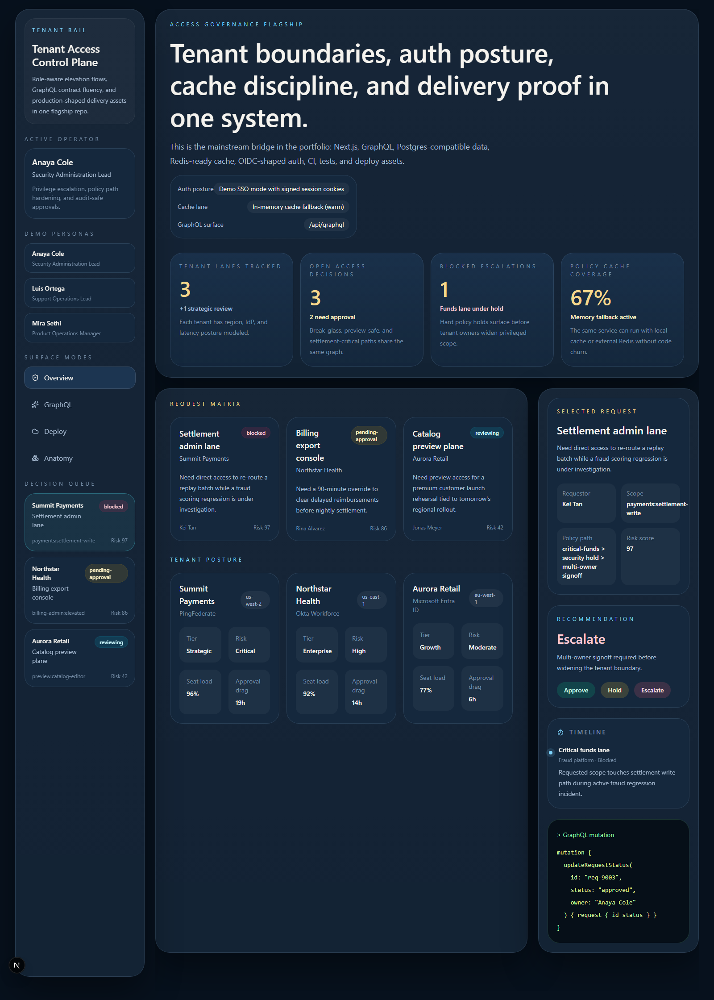
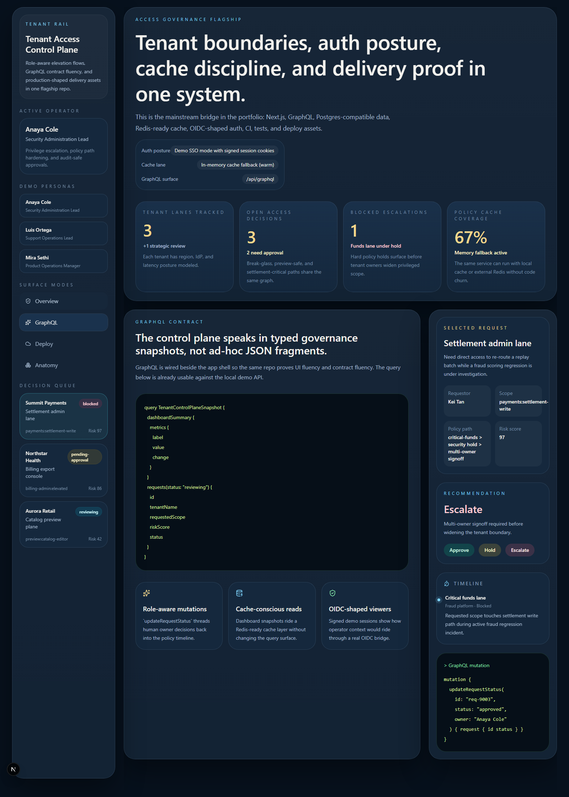
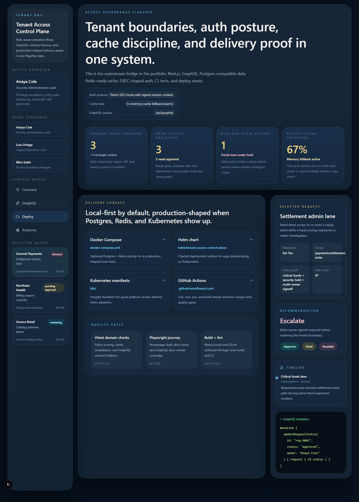
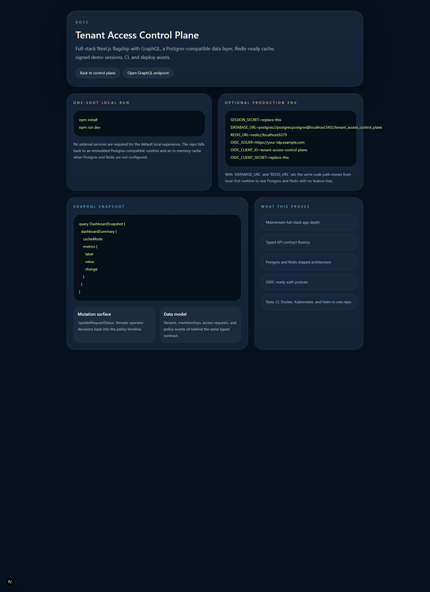

# Tenant Access Control Plane

Next.js flagship for **tenant access governance**, GraphQL contracts, role-aware approval flows, and production-style delivery assets.

> **What this repo proves**
>
> This is the broad-appeal full-stack control plane in the portfolio: modern frontend, typed API contract, real data layer, auth posture, tests, CI, and deploy assets in one product-shaped repo.

## Why this repo exists

This project closes the biggest broad-appeal gap in the portfolio:

- a modern full-stack app
- a real data layer
- a typed API contract
- auth posture
- caching
- tests
- CI
- deploy assets

It is intentionally local-first. You can boot it without Docker, Postgres, or Redis and still get the full experience. When those services are available, the same code path upgrades into a more production-shaped deployment.

## Stack

- Next.js App Router
- Tailwind CSS
- GraphQL Yoga
- Zustand
- Drizzle ORM
- PGlite local runtime with optional PostgreSQL
- Redis-ready cache fallback
- Signed demo session cookies with OIDC-ready configuration
- Vitest
- Playwright
- GitHub Actions
- Docker, Kubernetes manifests, and Helm chart

## One-shot local run

```powershell
cd tenant-access-control-plane
npm install
npm run dev
```

Open:

- [http://127.0.0.1:3000/](http://127.0.0.1:3000/)
- [http://127.0.0.1:3000/docs](http://127.0.0.1:3000/docs)
- [http://127.0.0.1:3000/api/graphql](http://127.0.0.1:3000/api/graphql)

## Optional production-style services

Create `.env.local` from [.env.example](./.env.example) and set any of the following:

- `DATABASE_URL`
- `REDIS_URL`
- `OIDC_ISSUER`
- `OIDC_CLIENT_ID`
- `OIDC_CLIENT_SECRET`
- `SESSION_SECRET`

If `DATABASE_URL` is not set, the repo falls back to a persistent local PGlite store under `.data/`.

If `REDIS_URL` is not set, the repo falls back to an in-memory TTL cache.

## Verification

```powershell
npm run lint
npm run test
npm run build
```

Optional e2e:

```powershell
npx playwright install chromium
npm run test:e2e
```

## GraphQL example

```graphql
query DashboardSnapshot {
  dashboardSummary {
    cacheMode
    metrics {
      label
      value
      change
    }
  }
}
```

## Deployment assets

- [Dockerfile](./Dockerfile)
- [docker-compose.yml](./docker-compose.yml)
- [k8s](./k8s)
- [helm/tenant-access-control-plane](./helm/tenant-access-control-plane)
- [.github/workflows/ci.yml](./.github/workflows/ci.yml)

## Screenshots

### Overview


### GraphQL Contract


### Delivery Surface


### Docs


## Repo anatomy

- [src/app/page.tsx](./src/app/page.tsx)
- [src/components/control-plane.tsx](./src/components/control-plane.tsx)
- [src/lib/domain/service.ts](./src/lib/domain/service.ts)
- [src/lib/graphql/schema.ts](./src/lib/graphql/schema.ts)
- [src/lib/db/schema.ts](./src/lib/db/schema.ts)
- [docs/architecture.md](./docs/architecture.md)
